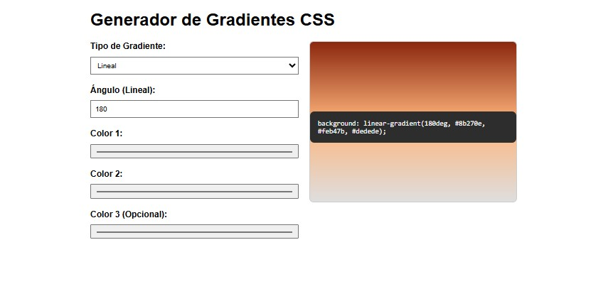

# Generador de Gradientes CSS

## Descripción
Aplicación web interactiva para crear y visualizar gradientes CSS en tiempo real. Permite generar gradientes lineales y radiales con hasta 3 colores, ajustar ángulos/posiciones y obtener automáticamente el código CSS resultante.

## Características
- **Tipos de gradiente**: Lineal y radial
- **Selector de colores**: 3 colores personalizables (con opción de transparencia)
- **Controles interactivos**:
  - Ajuste de ángulo (0-360°) para gradientes lineales
  - Posición radial (0-100%)
- **Vista previa en vivo**: Muestra el gradiente generado en un contenedor responsive
- **Generación automática de código**: Muestra el código CSS listo para usar
- **Diseño adaptable**: Funciona en dispositivos móviles y escritorio
